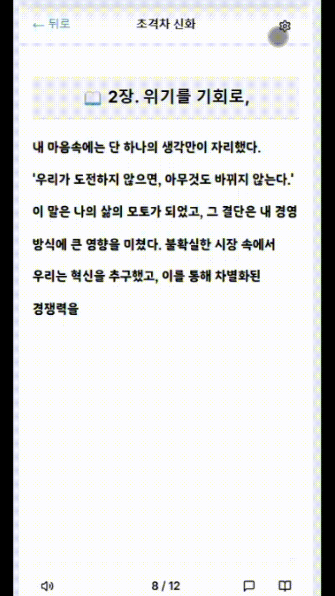
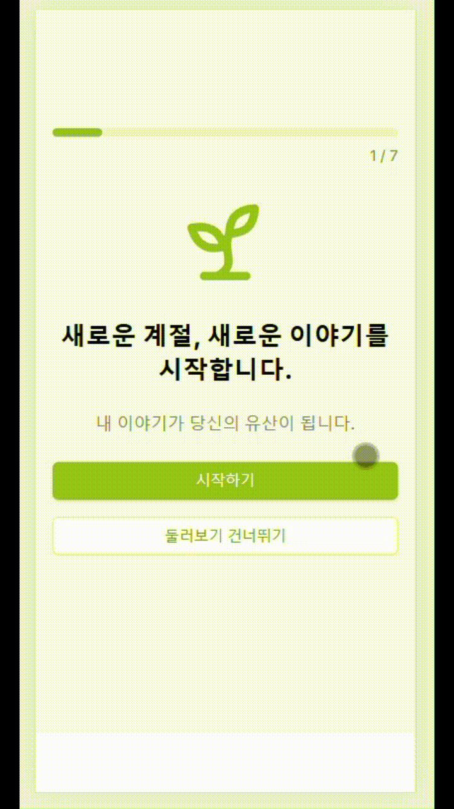
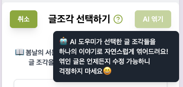
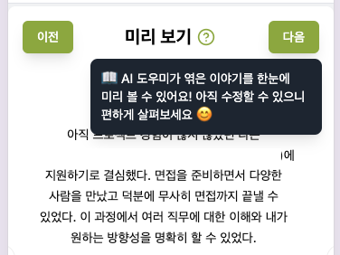
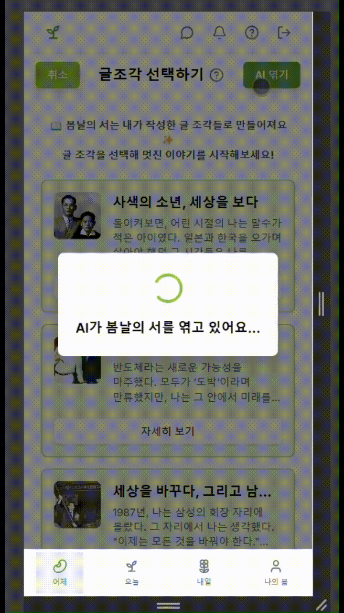
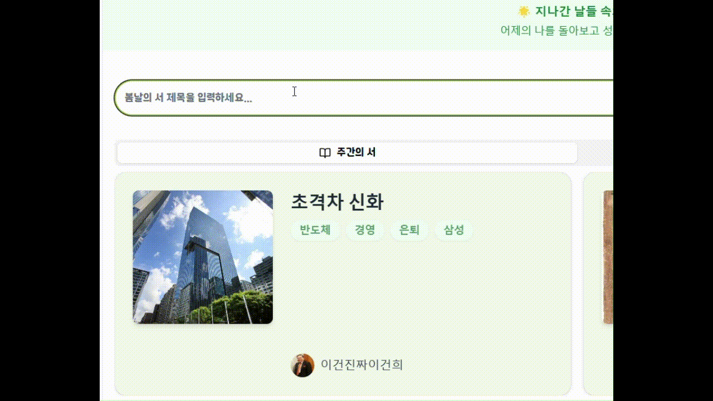
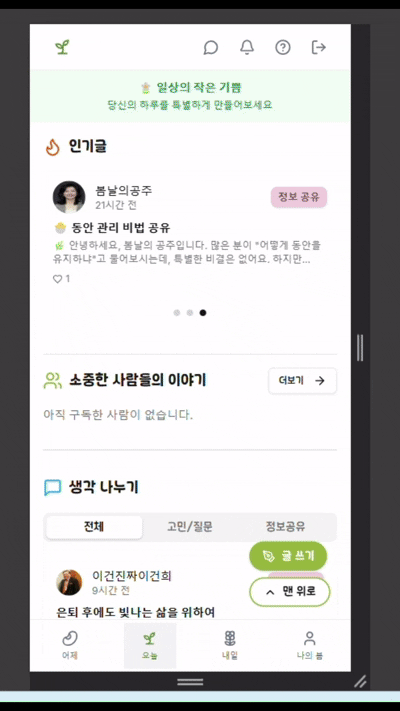
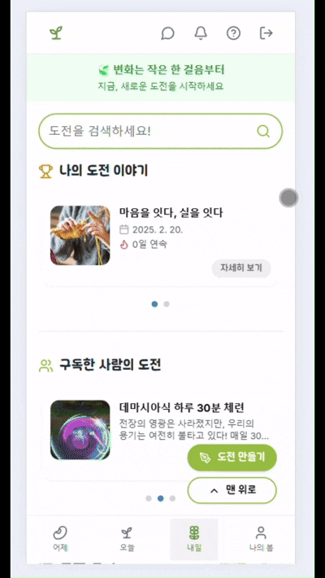

## 🌱 다시, 봄(Re: Spring)
> 퇴직자의 제2인생 지원을 위한 커뮤니티 플랫폼 – 소통(SNS), 기록(AI 자서전), 도전(챌린지)

 

## 📌 프로젝트 개요
"우리는 다시, 봄 (Re:Spring)"은 퇴직자들의 새로운 도전을 지원하는 올인원 플랫폼입니다.
퇴직 후의 불안감을 줄이고, 새로운 도전을 돕기 위해 자서전 작성, 커뮤니티, 챌린지 기능을 제공합니다.

- ✅ 퇴직 후 새로운 시작을 꿈꾸는 모든 분들을 위한 공간
- ✅ 기록하고, 공유하고, 성장하는 커뮤니티
- ✅ 자서전, 커뮤니티, 챌린지 - 함께 만들어가는 이야기

 

## 🔹 핵심 가치
- 🎯 퇴직자 맞춤형 서비스: 기존의 청년 중심 서비스와 차별화
- 🔄 자서전 + 커뮤니티 + 챌린지 융합: 새로운 삶을 설계하는 종합 플랫폼
- 📖 기록 & 공유: 인생을 돌아보고, 다음 세대와 지혜를 나눌 기회 제공

 

> 💫 중장년층 누구나 쉽게 시작할 수 있는 가이드와 UI 제공

- 커스텀 가능한 자서전 뷰어 제공
- 튜토리얼(온보딩) 제공
- 각 단계에서 도움말 제공

<table align="center">
    <tr>
        <td align="center" width="30%">
            
            
🔼 유저에 맞는 글자 크기, 글자체 커스텀

        </td>
        <td align="center" width="30%">
            
            
🔼 튜토리얼/온보딩

        </td>
    </tr>
</table>

 

<table align="center">
<tr>
    <td align="end" width="30%">
        
    </td>
    <td align="start" width="30%">
        
    </td>
</tr>
<tr>
    <td colspan="2" align="center">
        
🔼 각 페이지에 대한 도움말 제공

    </td>
</tr>
</table>

 

## 📌 주요 기능
### 1️⃣ 어제 (Autobiography: "봄날의 서")

> 나의 인생을 기록하고, 공유하는 AI 기반 자서전 서비스

<table>
    <tr>
    <td width="40%" align="center">
        
    </td>
    <td valign="top">
        <ul>
            <li>자신이 작성한 짧은 글 조각들을 엮어 하나의 자서전으로 자연스럽게 엮어주는 자서전 'AI 엮기'</li>
            <li>저자와의 1:1 채팅 기능 지원</li>
        </ul>
    </td>
    </tr>
</table>

<table>
    <tr>
    <td valign="top">
        <ul>
            <li>Elasticsearch + Redis 기반 검색/자동완성 지원</li>
        </ul>
    </td>
    <td width="40%" align="start" valign="top">
        
    </td>
    </tr>
</table>

### 2️⃣ 오늘 (Community: "소통 공간")
> 퇴직자들이 서로 경험을 공유하고, 조언을 주고받는 커뮤니티

<table>
    <tr>
    <td width="40%" align="center">
        
    </td>
    <td valign="top">
        <ul>
            <li>비슷한 고민을 가진 사용자, 이미 비슷한 고민을 해봤던 사용자와 교류 가능</li>
            <li>일자리, 재테크, 건강 등 다양한 주제로 소통</li>
        </ul>
    </td>
    </tr>
</table>

### 3️⃣ 내일 (Challenge: "미래 도전")
> 작은 목표를 세우고, 함께 도전하는 챌린지 기능

<table>
    <tr>
    <td width="40%" align="center">
        
    </td>
    <td valign="top">
        <ul>
            <li>퇴직 후에도 적극적인 삶을 살 수 있도록 목표 설정 & 도전 기능 제공</li>
            <li>같은 목표를 가진 사용자끼리 오픈 채팅방에서 소통하며 긍정적인 자극</li>
        </ul>
    </td>
    </tr>
</table>

 

## 🚀 기술 스택

### 🖥️ Backend & DevOps

### 🌐 Frontend

###  🐝 ️Database

### 🛠️ CI/CD & Collaboration

 

# 🏗️ Our Team

[📒 팀 노션](https://www.notion.so/Re-Spring-1704ec08d1a9804d951bda76eefbeb8a)

|                         조예슬                          |                          김민철                           |                          강승엽                           |                          박성욱                           |                          윤태한                           |                           안혜성                           |
| :-----------------------------------------------------: | :-------------------------------------------------------: | :-------------------------------------------------------: | :-------------------------------------------------------: | :-------------------------------------------------------: | :--------------------------------------------------------: |
|  |  |  |  |  |  |
|                         **BE**                          |                          **FE**                           |                          **BE**                           |                          **BE**                           |                          **FE**                           |                           **FE**                           |
|        [@seul1230](https://github.com/seul1230)         |       [@MovieGoers](https://github.com/MovieGoers)        |       [@SeungYeopp](https://github.com/SeungYeopp)        |       [@respectwo2](https://github.com/respectwo2)        |       [@taehanyoon](https://github.com/taehanyoon)        |       [@Hyeseong128](https://github.com/Hyeseong128)       |
